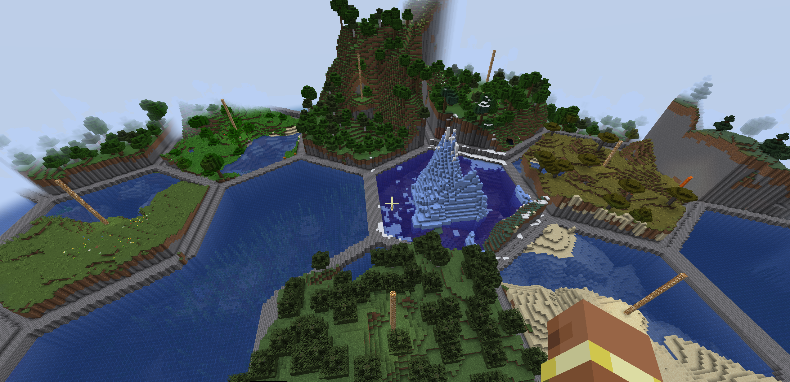

# HexLands Add-On: Hexed Structures

Add-on for your [HexLands](https://www.curseforge.com/minecraft/mc-mods/hexlands-ii) world   
to enable you to place custom structures only in the center of hexes.




## Usage
In the datapack for your structure modify the structure/mystruct.json:

```json
{
    "type": "hexed_structures:jigsaw", <----- this line
    "biomes": "#my:tags",
    "max_distance_from_center": 80,
    "project_start_to_heightmap": "WORLD_SURFACE_WG",
    "size": 7,
    "spawn_overrides": {},
    "start_height": {
        "absolute": 0
    },
    "start_pool": "my:pool",
    "step": "surface_structures",
    "terrain_adaptation": "beard_thin",
    "use_expansion_hack": false
}
```

and the structure_set/myset.json:
```json
{
    "structures": [
        {
            "structure": "my:structure",
            "weight": 1
        }
    ],
    "placement": {
        "type": "hexed_structures:center", <----- this line
        "spacing": 10,
        "separation": 6,
        "salt": 14347342873
    }
}
```

All other parameters work like vanilla. The base for the placement selection is the normal RandomSpread.

## Note
Structures are shifted so the bounding box center is over the hexagon center.